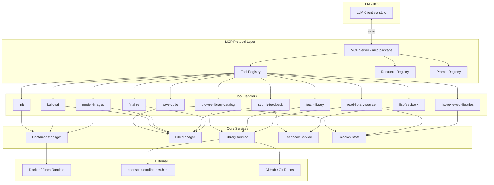
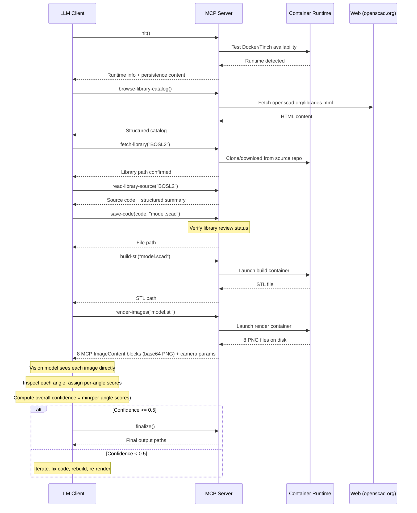

# Design Document: OpenSCAD MCP Server

## Overview

The OpenSCAD MCP Server is a Python-based Model Context Protocol server that enables LLMs to generate, compile, render, and inspect 3D models using OpenSCAD. The server exposes MCP tools, resources, and prompts over stdio transport, orchestrating a workflow that spans code authoring, containerized STL compilation, multi-angle image rendering, systematic visual inspection with confidence scoring, and user feedback collection.

The server is distributed as a standard Python package installable via `uvx openscad-mcp-server`. It uses Docker or Finch containers to run OpenSCAD builds and 3D rendering without requiring the host to have OpenSCAD installed. Libraries are discovered dynamically from the official OpenSCAD catalog and downloaded on demand from source repositories.

Key design goals:
- Zero manual configuration: auto-detect container runtime, persist settings via LLM memory
- Correctness-first workflow: enforce library source review before coding, thorough 8-angle inspection with per-angle confidence scores
- Vision-native image delivery: render tool returns MCP `ImageContent` blocks (base64-encoded PNG) so the LLM's vision model can directly see rendered images — not file paths
- Clean artifact management: overwrite semantics in working area, separate final output directory
- Feedback loop: structured feedback store with confidence disagreement tracking for future improvement

## Architecture

The system follows a layered architecture with clear separation between the MCP protocol layer, tool/resource handlers, container orchestration, and file management.



### Module Structure

```
openscad-mcp-server/
├── pyproject.toml                  # Package manifest, entry points, dependencies
├── Dockerfile.build                # Build container (OpenSCAD)
├── Dockerfile.render               # Render container (OpenSCAD for image export)
├── src/
│   └── openscad_mcp_server/
│       ├── __init__.py
│       ├── __main__.py             # Entry point: starts MCP server on stdio
│       ├── server.py               # MCP server setup, tool/resource/prompt registration
│       ├── tools/
│       │   ├── __init__.py
│       │   ├── init_tool.py        # Container runtime detection, persistence content
│       │   ├── save_code.py        # Save OpenSCAD code with library-review enforcement
│       │   ├── build_stl.py        # Containerized STL compilation
│       │   ├── render_images.py    # Multi-angle rendering, returns MCP ImageContent
│       │   ├── library_tools.py    # browse-catalog, fetch-library, read-source, list-reviewed
│       │   ├── feedback_tools.py   # submit-feedback, list-feedback
│       │   └── finalize.py         # Copy working area to final output
│       ├── services/
│       │   ├── __init__.py
│       │   ├── container.py        # Container runtime abstraction (Docker/Finch)
│       │   ├── file_manager.py     # Working area, final output, path management
│       │   ├── library_service.py  # Catalog fetching, library download, caching
│       │   ├── feedback_service.py # Feedback store, index management
│       │   └── session.py          # Session state: reviewed libraries, confidence scores
│       ├── resources/
│       │   ├── __init__.py
│       │   ├── openscad_syntax.py  # OpenSCAD language reference resource
│       │   ├── library_ref.py      # Library reference resource
│       │   └── pitfalls.py         # Common pitfalls resource
│       └── prompts/
│           ├── __init__.py
│           └── workflow.py         # Workflow prompt with inspection/confidence instructions
├── .github/
│   └── workflows/
│       ├── auto-tag.yml            # Auto-tag on PR merge to main
│       └── publish.yml             # Publish to PyPI on tag push
└── tests/
    ├── __init__.py
    ├── test_container.py
    ├── test_file_manager.py
    ├── test_library_service.py
    ├── test_feedback_service.py
    ├── test_session.py
    ├── test_save_code.py
    └── test_tools.py
```

### Request Flow

A typical model creation workflow follows this sequence:



## Components and Interfaces

### MCP Server Core (`server.py`)

The entry point creates an MCP server instance using the `mcp` Python package, registers all tools, resources, and prompts, and runs on stdio transport.

```python
# Pseudocode for server setup
from mcp.server import Server
from mcp.server.stdio import stdio_server

app = Server("openscad-mcp-server")

# Register tools via @app.tool() decorators
# Register resources via @app.resource() decorators
# Register prompts via @app.prompt() decorators

async def main():
    async with stdio_server() as (read_stream, write_stream):
        await app.run(read_stream, write_stream, app.create_initialization_options())
```

### Tool Interfaces

Each tool is an async function registered with the MCP server. Below are the tool signatures and their input/output contracts.

#### `init` Tool
- **Input**: None
- **Output**: `{ runtime: "docker"|"finch", executable_path: str, working_dir: str, persistence_content: str }`
- **Behavior**: Probes for Docker then Finch, runs a test container, returns detection results and formatted persistence content for the LLM's memory mechanism.

#### `save-code` Tool
- **Input**: `{ code: str, filename: str }`
- **Output**: `{ file_path: str }`
- **Behavior**: Validates filename (appends `.scad` if missing), parses `include`/`use` statements, checks session state for library review status, writes file to working area. Rejects save if referenced libraries haven't been reviewed.

#### `build-stl` Tool
- **Input**: `{ scad_file: str }`
- **Output**: `{ stl_path: str }` or `{ error: str, details: str }`
- **Behavior**: Launches build container with working directory mounted, runs `openscad -o output.stl <file>`, captures stdout/stderr. Returns STL path on success, full error output on failure.

#### `render-images` Tool — MCP ImageContent Delivery (Critical Design Decision)
- **Input**: `{ stl_file: str }`
- **Output**: A list of MCP content blocks — one `TextContent` block with camera metadata, followed by 8 `ImageContent` blocks (one per angle)
- **Behavior**: Launches render container, generates 8 PNG images at 1024x1024 from predefined camera angles. Reads each PNG from disk, base64-encodes it, and returns it as an MCP `ImageContent` block with `mimeType: "image/png"`. This is how the LLM's vision model "sees" the rendered model.

The MCP SDK's tool response supports a list of content blocks. The `render-images` tool constructs its response as:

```python
from mcp.types import ImageContent, TextContent

async def render_images(stl_file: str) -> list[TextContent | ImageContent]:
    # ... launch container, generate PNGs ...
    content_blocks = []

    # Text block with camera metadata for all angles
    content_blocks.append(TextContent(
        type="text",
        text=json.dumps({
            "angles": [
                {"label": angle.label,
                 "camera_position": angle.position,
                 "camera_rotation": angle.rotation}
                for angle in CAMERA_ANGLES
            ]
        })
    ))

    # One ImageContent block per angle — this is what the LLM's vision sees
    for angle in CAMERA_ANGLES:
        png_path = renders_dir / f"{angle.label}.png"
        b64_data = base64.b64encode(png_path.read_bytes()).decode("utf-8")
        content_blocks.append(ImageContent(
            type="image",
            data=b64_data,
            mimeType="image/png",
        ))

    return content_blocks
```

This approach is critical because:
1. MCP `ImageContent` blocks are the standard way to deliver images to LLM vision models
2. The LLM client receives the images inline in the tool response — no file path resolution needed
3. The LLM's vision capabilities can directly analyze each rendered angle
4. File paths alone would be useless to the LLM — it cannot open files on the host filesystem

#### `browse-library-catalog` Tool
- **Input**: None (or `{ force_refresh: bool }`)
- **Output**: `{ libraries: [{ name: str, description: str, source_url: str, docs_url: str }] }`
- **Behavior**: Fetches and parses `https://openscad.org/libraries.html`, extracts library entries. Caches result for session; `force_refresh` bypasses cache.

#### `fetch-library` Tool
- **Input**: `{ library_name: str, force_refresh: bool? }`
- **Output**: `{ library_path: str, message: str }`
- **Behavior**: Downloads library from source repository (git clone or archive download). Caches locally; `force_refresh` re-downloads. Places files in working directory's library path.

#### `read-library-source` Tool
- **Input**: `{ library_name: str }`
- **Output**: `{ source_code: str, summary: { modules: [...], coordinate_system: str, units: str } }`
- **Behavior**: Reads all `.scad` files from the fetched library, extracts module signatures and conventions, marks library as reviewed in session state.

#### `list-reviewed-libraries` Tool
- **Input**: None
- **Output**: `{ reviewed: [str] }`
- **Behavior**: Returns list of library names reviewed in current session.

#### `submit-feedback` Tool
- **Input**: `{ critique: str, root_cause_category: str? }`
- **Output**: `{ feedback_id: str, confidence_disagreement: bool }`
- **Behavior**: Creates timestamped feedback record, copies current working area state, records confidence score from last inspection, flags disagreement if score > 0.5, updates feedback index.

#### `list-feedback` Tool
- **Input**: None
- **Output**: `{ records: [{ id: str, timestamp: str, critique_summary: str, root_cause: str, confidence_score: float, confidence_disagreement: bool }] }`
- **Behavior**: Reads and returns the feedback index.

#### `finalize` Tool
- **Input**: None
- **Output**: `{ final_dir: str, files: [str] }`
- **Behavior**: Copies latest STL, SCAD, and images from working area to final output directory.

### Resource Interfaces

#### OpenSCAD Syntax Reference
- **URI**: `openscad://syntax-reference`
- **Content**: Comprehensive OpenSCAD language reference covering primitives (`cube`, `sphere`, `cylinder`), transformations (`translate`, `rotate`, `scale`), boolean operations (`union`, `difference`, `intersection`), module definitions, and variable scoping.

#### Library Reference
- **URI**: `openscad://library-reference/{library_name}`
- **Content**: Dynamic resource generated from fetched library source. Includes module signatures, parameter types/defaults, coordinate system conventions, and usage examples.

#### Common Pitfalls
- **URI**: `openscad://pitfalls`
- **Content**: Known error patterns: manifold errors, z-fighting, incorrect boolean order, coordinate system mismatches between libraries, missing `$fn` for smooth curves.

### Prompt Interface

#### Workflow Prompt
- **Name**: `openscad-workflow`
- **Content**: Step-by-step instructions covering the full workflow. Key sections:
  1. Check for persisted settings or run `init`
  2. Understand user request
  3. Browse library catalog, fetch needed libraries
  4. Read library source code (mandatory before coding)
  5. Document discovered module signatures and coordinate conventions
  6. Generate OpenSCAD code via `save-code`
  7. Build STL via `build-stl`
  8. Render 8 angles via `render-images`
  9. Systematic per-angle inspection with checklist and per-angle confidence scores
  10. Self-questioning on low confidence (< 0.5) angles
  11. Compute overall confidence as min of per-angle scores
  12. Iterate or finalize based on overall confidence
  13. Handle user feedback via `submit-feedback`

### Container Manager Service (`services/container.py`)

Abstracts Docker and Finch behind a common interface.

```python
class ContainerManager:
    def __init__(self, runtime: str, executable: str):
        """runtime is 'docker' or 'finch', executable is the path to the binary."""

    async def run(self, image: str, command: list[str], mounts: dict[str, str],
                  timeout: int = 300) -> ContainerResult:
        """Run a container and return stdout, stderr, exit code."""

    async def image_exists(self, image: str) -> bool:
        """Check if a container image is available locally."""

    async def build_image(self, dockerfile: str, tag: str) -> None:
        """Build a container image from a Dockerfile."""

    @staticmethod
    async def detect() -> tuple[str, str] | None:
        """Probe for Docker then Finch. Return (runtime, executable) or None."""
```

### Library Service (`services/library_service.py`)

Handles catalog fetching, library downloading, and caching.

```python
class LibraryService:
    def __init__(self, working_dir: Path):
        self._catalog_cache: list[LibraryCatalogEntry] | None = None
        self._library_cache: dict[str, Path] = {}

    async def browse_catalog(self, force_refresh: bool = False) -> list[LibraryCatalogEntry]:
        """Fetch and parse openscad.org/libraries.html."""

    async def fetch_library(self, name: str, source_url: str,
                            force_refresh: bool = False) -> Path:
        """Download library from source repo. Cache locally."""

    def read_source(self, name: str) -> LibrarySource:
        """Read .scad files, extract module signatures, return source + summary."""
```

### Feedback Service (`services/feedback_service.py`)

Manages the feedback store and index.

```python
class FeedbackService:
    def __init__(self, feedback_dir: Path):
        self._index_path = feedback_dir / "feedback-index.json"

    def submit(self, critique: str, root_cause: str | None,
               working_area: Path, confidence_score: float) -> FeedbackRecord:
        """Create feedback record, copy artifacts, update index."""

    def list_records(self) -> list[FeedbackSummary]:
        """Return all feedback records from index."""
```

### Session State (`services/session.py`)

Tracks per-session state: reviewed libraries, latest confidence score.

```python
class SessionState:
    def __init__(self):
        self.reviewed_libraries: set[str] = set()
        self.latest_confidence_score: float | None = None
        self.container_runtime: str | None = None
        self.container_executable: str | None = None
        self.working_dir: Path | None = None

    def mark_library_reviewed(self, name: str) -> None: ...
    def is_library_reviewed(self, name: str) -> bool: ...
    def set_confidence(self, score: float) -> None: ...
```

## Data Models

### Container Result

```python
@dataclass
class ContainerResult:
    exit_code: int
    stdout: str
    stderr: str
```

### Library Catalog Entry

```python
@dataclass
class LibraryCatalogEntry:
    name: str
    description: str
    source_url: str
    docs_url: str | None
```

### Library Source

```python
@dataclass
class ModuleSignature:
    name: str
    parameters: list[dict]  # [{"name": str, "type": str, "default": any}]

@dataclass
class LibrarySource:
    name: str
    source_code: str                    # Concatenated .scad file contents
    modules: list[ModuleSignature]
    coordinate_system: str | None       # e.g., "right-hand, Z-up"
    units: str | None                   # e.g., "millimeters"
```

### Camera Angle Configuration

```python
@dataclass
class CameraAngle:
    label: str                          # e.g., "front", "back-left-top-iso"
    position: tuple[float, float, float]
    rotation: tuple[float, float, float]

# Predefined 8 angles
CAMERA_ANGLES: list[CameraAngle] = [
    CameraAngle("front",               (0, -100, 0),    (90, 0, 0)),
    CameraAngle("back",                (0, 100, 0),     (90, 0, 180)),
    CameraAngle("left",                (-100, 0, 0),    (90, 0, 270)),
    CameraAngle("right",               (100, 0, 0),     (90, 0, 90)),
    CameraAngle("top",                 (0, 0, 100),     (0, 0, 0)),
    CameraAngle("bottom",              (0, 0, -100),    (180, 0, 0)),
    CameraAngle("front-right-top-iso", (80, -80, 80),   (55, 0, 45)),
    CameraAngle("back-left-top-iso",   (-80, 80, 80),   (55, 0, 225)),
]
```

### Inspection Image

```python
@dataclass
class InspectionImage:
    angle: str
    base64_png: str
    camera_position: tuple[float, float, float]
    camera_rotation: tuple[float, float, float]
```

### Feedback Record

```python
@dataclass
class FeedbackRecord:
    id: str                             # Timestamp-based ID, e.g., "20250101T120000"
    timestamp: str                      # ISO 8601
    critique: str
    root_cause_category: str | None
    root_cause_analysis: str            # Generated analysis of likely cause
    confidence_score: float | None      # From most recent inspection
    confidence_disagreement: bool       # True if score > 0.5 but user gave negative feedback
    artifacts_dir: str                  # Path to copied images/code snapshot
```

### Feedback Index

```python
@dataclass
class FeedbackIndexEntry:
    id: str
    timestamp: str
    critique_summary: str               # First 200 chars of critique
    root_cause_category: str | None
    confidence_score: float | None
    confidence_disagreement: bool
```

The feedback index is stored as a JSON file (`feedback-index.json`) in the feedback store directory. Each entry corresponds to a subdirectory containing the full feedback record and artifact copies.

### Working Directory Layout

```
{working_dir}/
├── working/                    # Working_Area - overwritten each iteration
│   ├── model.scad              # Latest OpenSCAD code
│   ├── model.stl               # Latest STL output
│   └── renders/                # Latest inspection images
│       ├── front.png
│       ├── back.png
│       ├── left.png
│       ├── right.png
│       ├── top.png
│       ├── bottom.png
│       ├── front-right-top-iso.png
│       └── back-left-top-iso.png
├── output/                     # Final_Output - populated on finalize
│   ├── model.scad
│   ├── model.stl
│   └── renders/
│       └── *.png
├── libraries/                  # Fetched library files
│   └── {library_name}/
│       └── *.scad
└── feedback/                   # Feedback_Store
    ├── feedback-index.json
    └── {timestamp}/            # Individual feedback records
        ├── record.json
        ├── model.scad
        ├── model.stl
        └── renders/
            └── *.png
```

### Container Images

#### Build Container (`Dockerfile.build`)
- Base: `ubuntu:24.04` or `openscad/openscad` if available
- Installs: `openscad` package
- Entrypoint: `openscad` CLI
- Working directory mount: `/work`
- Library path mount: `/work/libraries` mapped to OpenSCAD's `OPENSCADPATH`

#### Render Container (`Dockerfile.render`)
- Base: Same as build container (OpenSCAD supports `--export-format png` with `--camera` parameters)
- Uses OpenSCAD's built-in PNG export: `openscad --camera=x,y,z,rx,ry,rz --imgsize=1024,1024 --export-format png -o output.png input.stl`
- Note: A single Dockerfile may serve both build and render purposes since OpenSCAD handles both STL compilation and image export. The design keeps them logically separate for flexibility but the implementation may use one image.

### Catalog Parsing

The `browse-library-catalog` tool fetches `https://openscad.org/libraries.html` and parses the HTML to extract library entries. The parser uses `BeautifulSoup` or similar HTML parser to find library listings. Each entry is expected to contain:
- Library name (from heading or link text)
- Description (from paragraph text)
- Source repository URL (from link href, typically GitHub)
- Documentation URL (from link href, if present)

The parser is designed to be resilient to minor HTML structure changes and logs warnings for entries it cannot fully parse.


## Correctness Properties

*A property is a characteristic or behavior that should hold true across all valid executions of a system — essentially, a formal statement about what the system should do. Properties serve as the bridge between human-readable specifications and machine-verifiable correctness guarantees.*

### Property 1: Save-code round trip

*For any* valid OpenSCAD code string and any filename, saving the code via `save-code` and then reading the file at the returned path should yield the exact same code string. The returned path must be absolute and end with `.scad`.

**Validates: Requirements 4.1, 4.4**

### Property 2: Filename extension normalization

*For any* filename string, the output path from `save-code` should always end with `.scad`. If the input already ends with `.scad`, it should not be doubled (e.g., `foo.scad` stays `foo.scad`, not `foo.scad.scad`). If the input does not end with `.scad`, the extension is appended.

**Validates: Requirements 4.3**

### Property 3: Container command generation is runtime-agnostic

*For any* container run request (image, command, mounts, timeout) and *for any* supported runtime ("docker" or "finch"), the generated CLI command should be structurally identical except for the executable name. Both should include the same mount arguments, image reference, and command arguments.

**Validates: Requirements 5.2, 6.3**

### Property 4: Container mount correctness

*For any* build or render invocation with a working directory and a set of fetched libraries, the generated container command should include mount arguments for both the working directory (at `/work`) and the library directory (at the OpenSCAD library path).

**Validates: Requirements 5.5, 9.6**

### Property 5: Build error propagation

*For any* `ContainerResult` with a non-zero exit code, the build-stl tool's response should include the full stderr content from the container, preserving line numbers and error descriptions.

**Validates: Requirements 5.4**

### Property 6: Container start failure diagnostics

*For any* container start failure, the error message should distinguish between "runtime unavailable" (executable not found) and "image missing" (image not present locally), and should include the image name in the error.

**Validates: Requirements 5.6, 8.4**

### Property 7: Render produces exactly 8 images with correct angles

*For any* successful render invocation, the output should contain exactly 8 `ImageContent` blocks, one for each of the predefined camera angles (front, back, left, right, top, bottom, front-right-top-iso, back-left-top-iso), with no duplicates and no missing angles.

**Validates: Requirements 6.1, 6.2, 6.4**

### Property 8: Render command specifies PNG at 1024x1024

*For any* render command generated for any camera angle, the command arguments should include `--imgsize=1024,1024` and specify PNG output format.

**Validates: Requirements 6.5**

### Property 9: Partial render failure reports failed angles

*For any* render invocation where a subset of angles fail, the error response should list exactly the labels of the failed angles and include the error output for each, while still returning successfully rendered images.

**Validates: Requirements 6.6**

### Property 10: Render tool returns MCP ImageContent blocks

*For any* successful render invocation, each rendered angle should be returned as an MCP `ImageContent` block with `type="image"`, `mimeType="image/png"`, and a non-empty base64-encoded `data` field. An accompanying `TextContent` block should contain the camera position and rotation parameters for all angles.

**Validates: Requirements 7.1, 7.2**

### Property 11: Catalog parser extracts structured entries

*For any* well-formed HTML page containing library listings in the expected structure from openscad.org/libraries.html, the parser should extract at least one `LibraryCatalogEntry` where each entry has a non-empty name, description, and source URL.

**Validates: Requirements 9.1**

### Property 12: Library cache hit avoids re-download

*For any* library that has been fetched once, calling `fetch_library` again without `force_refresh` should return the same local path without triggering a new download. Calling with `force_refresh=True` should trigger a fresh download.

**Validates: Requirements 9.5**

### Property 13: Fetch-library success returns valid path

*For any* successful library fetch, the returned path should exist on disk and contain at least one `.scad` file, and the library should be available for `read-library-source`.

**Validates: Requirements 9.7**

### Property 14: Fetch-library failure includes source URL

*For any* failed library download, the error message should contain the source repository URL and a non-empty reason string.

**Validates: Requirements 9.8**

### Property 15: Init tool runtime detection

*For any* environment where exactly one of Docker or Finch is available, the init tool should detect and return that runtime. When both are available, Docker should be preferred. When neither is available, an error listing both runtimes with installation instructions should be returned.

**Validates: Requirements 10.1, 10.5**

### Property 16: Working area overwrite invariant

*For any* sequence of `save-code`, `build-stl`, and `render-images` operations, the working area should contain at most one `.scad` file, at most one `.stl` file, and exactly the set of images from the most recent render. Previous artifacts of the same type are replaced, not accumulated.

**Validates: Requirements 11.1, 11.2, 11.3, 11.4**

### Property 17: Finalize copies all working area artifacts

*For any* working area containing a `.scad` file, `.stl` file, and render images, invoking `finalize` should produce a final output directory containing copies of all those files with identical content.

**Validates: Requirements 11.5**

### Property 18: Feedback record completeness

*For any* feedback submission with a critique string, the created `FeedbackRecord` should contain the critique text, a valid ISO 8601 timestamp, a root cause analysis string, the current confidence score (if any), and a subdirectory containing copies of the current working area artifacts (images and code).

**Validates: Requirements 12.2, 12.3, 12.4, 12.5, 12.8**

### Property 19: Feedback index round trip

*For any* sequence of N feedback submissions, the feedback index file should contain exactly N entries, and `list-feedback` should return all N records. Each index entry should include the timestamp, critique summary, root cause category, confidence score, and confidence disagreement flag.

**Validates: Requirements 12.6, 12.7, 12.10**

### Property 20: Confidence disagreement flag logic

*For any* feedback submission, if the most recent confidence score is above 0.5, the `confidence_disagreement` flag should be `True`. If the score is 0.5 or below (or absent), the flag should be `False`.

**Validates: Requirements 12.9**

### Property 21: Version-tag matching

*For any* version string from pyproject.toml and any git tag string, the release pipeline's version check should pass if and only if the tag equals `"v" + version` (e.g., version `1.2.3` matches tag `v1.2.3`).

**Validates: Requirements 14.5**

### Property 22: Overall confidence is minimum of per-angle scores

*For any* list of 8 per-angle confidence scores (each between 0.0 and 1.0), the overall confidence score should equal the minimum value in the list.

**Validates: Requirements 16.8**

### Property 23: Read-library-source returns source and summary

*For any* fetched library containing `.scad` files, `read-library-source` should return the concatenated source code of all `.scad` files and a structured summary listing module names, parameter signatures, coordinate system conventions, and unit conventions.

**Validates: Requirements 2.2, 2.4, 17.1, 17.4**

### Property 24: Library review enforcement on save

*For any* OpenSCAD code string containing `include` or `use` statements referencing a library, `save-code` should reject the save with an error if that library has not been marked as reviewed in the session state. If the library has been reviewed, the save should succeed.

**Validates: Requirements 17.2, 17.3**

### Property 25: Reviewed libraries tracking round trip

*For any* sequence of `read-library-source` calls for distinct library names, `list-reviewed-libraries` should return exactly those names. Calling `read-library-source` for the same library twice should not produce duplicates.

**Validates: Requirements 17.6**


## Error Handling

### Container Errors

| Error Condition | Detection | Response |
|---|---|---|
| Container runtime not found | `shutil.which("docker")` and `shutil.which("finch")` both return `None` | Return error listing supported runtimes with installation URLs |
| Container image missing | `docker/finch image inspect` returns non-zero | Return error with image name and `docker build` / `finch build` instructions |
| Container execution timeout | `asyncio.wait_for` exceeds timeout (default 300s) | Kill container process, return timeout error with the command that was run |
| Container non-zero exit | `ContainerResult.exit_code != 0` | Return full stderr from container, preserving line numbers for OpenSCAD errors |
| Container mount failure | Container start fails with mount-related error in stderr | Return error identifying the mount path that failed |

### Network Errors

| Error Condition | Detection | Response |
|---|---|---|
| Catalog fetch failure | HTTP error or timeout from `openscad.org/libraries.html` | Return error with HTTP status code and URL; suggest retry |
| Library download failure | Git clone or archive download fails | Return error with source repository URL and failure reason (auth, not found, network) |
| DNS resolution failure | `aiohttp` or `httpx` raises connection error | Return error suggesting network connectivity check |

### File System Errors

| Error Condition | Detection | Response |
|---|---|---|
| Working directory not writable | `OSError` on file write | Return error with path and permission details |
| Disk space exhaustion | `OSError` with `ENOSPC` | Return error suggesting cleanup of old artifacts |
| Library path not found | `FileNotFoundError` when reading library source | Return error instructing to run `fetch-library` first |

### Tool-Specific Errors

| Error Condition | Detection | Response |
|---|---|---|
| Library not reviewed before save | `include`/`use` statement references library not in `session.reviewed_libraries` | Reject save with error listing unreviewed libraries and instruction to call `read-library-source` |
| Empty or whitespace-only code | Code string is empty or whitespace after strip | Reject save with descriptive error |
| Invalid STL file path | Path doesn't exist or doesn't end with `.stl` | Return error with the invalid path and expected format |
| Feedback with no prior inspection | `session.latest_confidence_score` is `None` | Accept feedback but record `confidence_score: null` and `confidence_disagreement: false` |
| Catalog parse failure | HTML structure doesn't match expected patterns | Return partial results with warnings for unparseable entries; never return empty on partial failure |

### Error Response Format

All tool errors follow a consistent structure:

```python
# Errors are returned as TextContent with is_error=True
from mcp.types import TextContent

def make_error(message: str, details: str | None = None) -> list[TextContent]:
    error_text = message
    if details:
        error_text += f"\n\nDetails:\n{details}"
    return [TextContent(type="text", text=error_text)]
```

The MCP SDK supports marking tool responses as errors. All error responses use `is_error=True` in the tool result so the LLM client can distinguish errors from successful results programmatically.


## Testing Strategy

### Dual Testing Approach

The project uses both unit tests and property-based tests. Unit tests verify specific examples, edge cases, and integration points. Property-based tests verify universal properties across randomly generated inputs. Together they provide comprehensive coverage — unit tests catch concrete bugs, property tests verify general correctness.

### Property-Based Testing Library

The project uses **Hypothesis** (`hypothesis` Python package) for property-based testing. Hypothesis is the standard PBT library for Python, supports custom strategies for generating complex data, and integrates with pytest.

Configuration:
- Minimum 100 examples per property test via `@settings(max_examples=100)`
- Each property test is tagged with a comment referencing the design property
- Tag format: `# Feature: openscad-mcp-server, Property {number}: {property_text}`
- Each correctness property is implemented by a single property-based test

### Property Test Plan

| Property | Test Description | Key Generators |
|---|---|---|
| 1: Save-code round trip | Generate random code strings and filenames, save, read back, compare | `st.text()` for code, `st.text(alphabet=filename_chars)` for filenames |
| 2: Filename extension normalization | Generate filenames with/without `.scad`, verify output always ends `.scad` without doubling | `st.text(alphabet=filename_chars)` with `.scad` suffix strategies |
| 3: Runtime-agnostic commands | Generate container run params, compare Docker vs Finch command output | `st.text()` for image/command, `st.dictionaries()` for mounts |
| 4: Container mount correctness | Generate working dir and library paths, verify mount args in command | `st.from_regex()` for paths |
| 5: Build error propagation | Generate `ContainerResult` with non-zero exit and random stderr, verify stderr in response | `st.integers(min_value=1)` for exit code, `st.text()` for stderr |
| 6: Container start failure diagnostics | Generate failure types (runtime missing, image missing), verify error message content | `st.sampled_from(["runtime_unavailable", "image_missing"])` |
| 7: Render produces 8 images | Mock container to return N images, verify exactly 8 with correct angle labels | Fixed angles, mock container output |
| 8: Render command 1024x1024 PNG | Generate camera angles, verify command includes `--imgsize=1024,1024` and PNG format | `st.tuples(st.floats(), st.floats(), st.floats())` for positions |
| 9: Partial render failure | Generate subsets of failing angles, verify error lists exactly those angles | `st.sets(st.sampled_from(ANGLE_LABELS))` for failure sets |
| 10: MCP ImageContent blocks | Mock render output, verify each image is `ImageContent` with correct mime type and non-empty data | Mock PNG bytes |
| 11: Catalog parser | Generate HTML fragments with library entries, verify parsed output | Custom HTML strategy with library name/description/URL |
| 12: Library cache hit | Fetch library, fetch again, verify no re-download; force_refresh triggers download | `st.text()` for library names |
| 13: Fetch success valid path | Mock successful download, verify path exists and contains `.scad` files | Mock filesystem |
| 14: Fetch failure includes URL | Generate failure scenarios with URLs and reasons, verify error content | `st.from_regex(url_pattern)`, `st.text()` for reasons |
| 15: Init runtime detection | Generate environment states (docker only, finch only, both, neither), verify detection | `st.sampled_from` for environment configs |
| 16: Working area overwrite | Generate sequences of save/build/render operations, verify working area contents after each | `st.lists(st.sampled_from(["save", "build", "render"]))` |
| 17: Finalize copies artifacts | Generate working area with random file contents, finalize, compare | `st.binary()` for file contents |
| 18: Feedback record completeness | Generate critique strings and confidence scores, submit, verify record fields | `st.text()` for critique, `st.floats(0, 1)` for scores |
| 19: Feedback index round trip | Generate N feedback submissions, verify index has N entries with correct fields | `st.integers(1, 20)` for N, nested strategies for submissions |
| 20: Confidence disagreement flag | Generate confidence scores, submit feedback, verify flag matches score > 0.5 | `st.floats(0, 1)` for scores |
| 21: Version-tag matching | Generate version strings and tags, verify match logic | `st.from_regex(r"\d+\.\d+\.\d+")` for versions |
| 22: Overall confidence minimum | Generate lists of 8 floats in [0,1], verify overall = min | `st.lists(st.floats(0, 1), min_size=8, max_size=8)` |
| 23: Read-library-source | Generate library directories with `.scad` files, verify source and summary | Custom strategy for `.scad` file contents |
| 24: Library review enforcement | Generate code with `include`/`use` statements and session states, verify accept/reject | `st.text()` for code with injected include statements |
| 25: Reviewed libraries tracking | Generate sequences of `read-library-source` calls, verify `list-reviewed-libraries` output | `st.lists(st.text())` for library names |

### Unit Test Plan

Unit tests cover specific examples, edge cases, and integration points that complement the property tests:

- **Server initialization**: Verify tool/resource/prompt registration returns expected names
- **Workflow prompt content**: Verify prompt contains required instruction sections (library review mandate, per-angle inspection, confidence thresholds)
- **Resource content**: Verify syntax reference, pitfalls resource contain expected sections
- **Dockerfile existence**: Verify Dockerfile.build and Dockerfile.render are present and valid
- **pyproject.toml structure**: Verify PEP 621 compliance, entry point declaration, dependency list
- **Edge cases**: Empty code string, filename with multiple dots, library name with special characters, feedback with no prior renders
- **Directory auto-creation**: Verify working area and final output directories are created if missing
- **Catalog HTML edge cases**: Malformed HTML, empty page, missing fields in library entries

### Test Organization

```
tests/
├── conftest.py                     # Shared fixtures: temp dirs, mock container, session state
├── test_save_code.py               # Properties 1, 2, 24 + unit tests
├── test_container.py               # Properties 3, 4, 5, 6 + unit tests
├── test_render.py                  # Properties 7, 8, 9, 10 + unit tests
├── test_library_service.py         # Properties 11, 12, 13, 14, 23 + unit tests
├── test_init.py                    # Property 15 + unit tests
├── test_file_manager.py            # Properties 16, 17 + unit tests
├── test_feedback.py                # Properties 18, 19, 20 + unit tests
├── test_session.py                 # Property 25 + unit tests
├── test_version.py                 # Property 21 + unit tests
├── test_confidence.py              # Property 22 + unit tests
└── test_prompts.py                 # Unit tests for prompt/resource content
```

### Test Dependencies

```toml
[project.optional-dependencies]
test = [
    "pytest>=8.0",
    "pytest-asyncio>=0.23",
    "hypothesis>=6.100",
    "pytest-tmp-files>=0.1",
]
```
